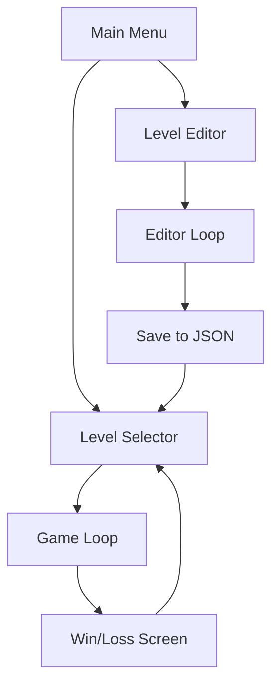

# Edge Clone Technical Specification

## Core Mechanics
- **Rolling**: The cube rotates around its edges to move between grid cells.
    - *Implementation*: Use a pivot point at the edge of the cube. Rotate 90 degrees over a fixed duration.
    - *State*: `isMoving` flag to prevent input during animation.
- **Climbing**: If the cube rolls against a wall, it can climb up if there is space.
    - *Logic*: Check for a block at `targetPos + [0, 1, 0]`. If empty and `targetPos` is occupied, pivot around the top edge of the obstacle.
- **Shrinking**: The cube can shrink to 1/8th of its volume (0.5x0.5x0.5) when standing on a "Shrink Pad".
    - *Mechanics*:
        - Can fit through 0.5 unit gaps.
        - Moves faster but cannot climb full-sized blocks.
        - Can be "crushed" if it expands in a tight space.
    - *Implementation*: Scale the mesh and adjust the collision box. Grid movement remains 1.0 units but the cube occupies only a sub-grid or a corner.
- **Edge Hanging**: The cube can balance on an edge or corner to reach further or wait for platforms.
    - *Logic*: If the cube's center of mass is over a void but an edge is supported, allow a "balancing" state where the player can hold the position or fall.
- **Edge Time**: A bonus mechanic where staying in a "balancing" state (edge hanging) rewards the player with time reduction or points.
    - *Implementation*: A timer starts when the cube enters the balancing state. If the cube successfully rolls onto a solid block afterwards, the "Edge Time" is added to the score/subtracted from the level timer.

## Collision System
- **Grid-Based Lookup**: Store level blocks in a 3D Map or Hash Table `levelData[x][y][z]` for O(1) lookup.
- **Movement Validation**:
    - *Normal Move*: Check if `targetPos` is empty AND `targetPos - [0, 1, 0]` is solid.
    - *Climb Move*: Check if `targetPos` is solid AND `targetPos + [0, 1, 0]` is empty.
    - *Fall*:
        - Triggered if the cube moves to a cell where `y-1` is empty.
        - *Animation*: Linear downward movement with increasing velocity (gravity simulation).
        - *Landing*: If a block is hit, snap to the grid and play "thud" sound.
        - *Death*: If `y < -10` (or level bounds), restart level or respawn at last checkpoint.
- **Crush Logic**:
    - *Trigger*: Occurs when the player's space is occupied by a solid block (e.g., a moving platform or expanding from "shrunk" state).
    - *Detection*: Check if the player's current grid cell is occupied by a non-player object.
    - *Result*: Play "crush" sound, trigger "disassemble" animation, and respawn at the last checkpoint.
- **Dynamic Objects**:
    - *Moving Platforms*:
        - Follow a predefined path (array of grid coordinates).
        - If the player is on top, the player's position is updated by the platform's delta movement.
        - Collision: If a platform moves into the player from the side, it should push the player or cause a "crush" state.
    - *Switches*:
        - Triggered when the player stands on them.
        - Can toggle visibility/collision of "Ghost Blocks" or move platforms.
    - *Ghost Blocks*:
        - Semi-transparent blocks that can be toggled on/off by switches.
        - When "off", they have no collision.
        - When "on", they act as normal blocks.
        - *Visuals*: Pulsing opacity or wireframe when "off".
    - *Checkpoints*:
        - Special blocks that save the player's current position.
        - If the player falls or is crushed, they respawn at the last activated checkpoint.
        - *Visuals*: Glows when activated.
    - *Prisms*:
        - Collectible items scattered throughout the level.
        - *Logic*: Removed from the scene and added to the level's `collectedPrisms` count when the player's bounding box intersects the prism.
        - *Visuals*: Rotating, glowing diamond shape.
- **Edge Balancing**: Triggered when the cube is rotated 45-90 degrees and the supporting edge is on a block, but the target cell is empty.

## Level Editor UI
- **Tools**:
    - *Brush*: Place blocks on click.
    - *Eraser*: Remove blocks on click.
    - *Select*: Modify properties of existing blocks (e.g., moving platform path).
- **Palette**:
    - Block types: Normal, Start, End, Moving, Switch, Prism.
    - Color picker for blocks.
- **Controls**:
    - `OrbitControls` for camera movement.
    - `Shift + Click` to delete.
    - `Ctrl + S` to export JSON.
- **Editor Shortcuts**:
    - `1-6`: Select block type from palette.
    - `B`: Brush tool.
    - `E`: Eraser tool.
    - `S`: Select tool.
    - `G`: Toggle grid visibility.
    - `Ctrl + Z`: Undo.
    - `Ctrl + Y`: Redo.
- **Undo/Redo System**:
    - *Implementation*: Use a Command Pattern. Each action (Add, Remove, Modify) is an object with `execute()` and `undo()` methods.
    - *Stack*: Maintain two stacks (`undoStack` and `redoStack`) with a maximum depth (e.g., 50 actions).
- **Level Validation**:
    - *Requirements*:
        - Must have exactly one "Start" block.
        - Must have at least one "End" block.
        - All moving platforms must have at least two path points.
    - *Feedback*: Show a warning in the editor if validation fails before saving.
- **Minimap**:
    - *Implementation*: A secondary, smaller Three.js renderer or a top-down `OrthographicCamera` view in a corner `div`.
    - *Visuals*: Simplified representation of the grid (e.g., 2D squares).
    - *Functionality*: Shows player position, prisms, and the end goal.
- **Overlay**: HTML/CSS overlay for tool selection and level metadata input.

## Mobile Controls
- **On-Screen D-Pad**: Transparent overlay with four directional buttons.
- **Gestures**:
    - *Swipe*: Alternative to D-Pad for movement.
    - *Tap*: Interact with UI or pause.
- **Responsive Design**: UI elements should scale based on screen size using CSS Flexbox/Grid.

## Visual Style
- **Aesthetic**: Minimalist, geometric, high-contrast.
- **Colors**:
    - Background: Dark grey or black (#111111).
    - Player Cube: White (#FFFFFF) with a slight glow or wireframe overlay.
    - Blocks: Shades of grey, with specific colors for interactive elements (Green for Start, Red for End, Blue for Moving).
- **Lighting**:
    - `AmbientLight` for general visibility.
    - `DirectionalLight` with shadows enabled to give depth to the 3D grid.
    - `PointLight` attached to the player for a "searchlight" effect in dark levels.
- **Camera Behavior**:
    - *Type*: `PerspectiveCamera` for a dynamic feel or `OrthographicCamera` for a classic Edge look.
    - *Follow*: The camera should smoothly interpolate (`lerp`) towards a target position relative to the player.
    - *Rotation*: Fixed isometric-style angle (e.g., 45 degrees) but allows slight tilting based on movement.
    - *Editor*: Free-roaming camera with `OrbitControls`.
- **Post-Processing**: Optional Bloom effect to make the white cube and prisms "pop".

## Audio
- **Engine**: Web Audio API or Three.js `AudioListener`.
- **SFX**:
    - *Roll*: Low-frequency "thud" or mechanical click.
    - *Climb*: Slightly higher pitch "clack".
    - *Fall*: Whistling sound followed by a crash.
    - *Prism Collect*: High-pitched crystalline chime.
    - *Switch Toggle*: Metallic click.
- **Music**: Ambient, electronic/minimalist loop.

## Level Progression
- **Unlocking**: Levels are unlocked sequentially. Completing Level 1 unlocks Level 2.
- **Scoring**:
    - *Time*: Faster completion yields higher rank (S, A, B, C).
    - *Prisms*: Collecting all prisms is required for an S-rank.
    - *Edge Time*: Bonus points for balancing.
- **Persistence**: Use `localStorage` to save unlocked levels and high scores.

## Level Transitions
- **Fade Effect**: Smooth black-to-transparent fade when entering/exiting a level.
- **Animation**: The player cube could "assemble" from smaller blocks at the start and "disassemble" or fly off at the end.
- **UI**: Show level stats (time, prisms) during the transition.

## JSON Level Schema
```json
{
  "metadata": {
    "name": "Level 1",
    "author": "Player",
    "difficulty": "Easy",
    "parTime": 60,
    "dimensions": { "x": 20, "y": 10, "z": 20 },
    "theme": "default"
  },
  "blocks": [
    { "type": "normal", "pos": [0, 0, 0], "color": "#ffffff" },
    { "type": "start", "pos": [1, 0, 1] },
    { "type": "end", "pos": [10, 0, 10] },
    { "type": "moving", "pos": [5, 0, 5], "path": [[5,0,5], [5,0,8]], "speed": 0.05 }
  ],
  "prisms": [
    { "pos": [2, 1, 2] }
  ]
}
```

## System Architecture
- **State Management**: Simple object to track cube position, orientation, and level state.
- **Rendering**: Three.js with `BoxGeometry` for blocks and the player.
- **Input**: Keyboard (Arrows/WASD) for movement.
- **Editor**: Raycasting to place/remove blocks on a grid.

## Workflow Diagram

